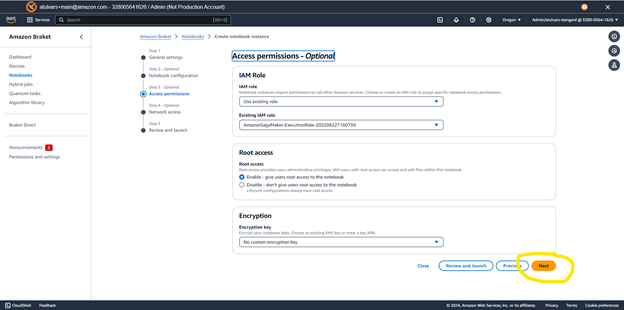

# Create Jupyter notebook
1.	Log-on to the AWS console

2.	Type ‘Braket’ in the services search box, and then click on Amazon Braket in the search results dropdown

3.	On the Braket console view, click on Notebooks on the left panel

4.	And then click on the orange colored button ‘Create’ under ‘Standard notebook’ section. If you have some pre-existing notebooks, you will see an orange button ‘Create notebook instance’, click it.

5.	On the next screen, fill in a name for your Jupyter notebook, such as ‘grovers-algorithm’. Keep all the other values as default, and click on the orange colored button ‘Next’ at the bottom.

6.	Follow subsequent pages, keep the default values on each page. On the last page, click on the ‘Launch’ button.

 
7.	After several minutes the notebook will be ready, and you will see a regular Jupyter notebook UI 

8.	From this point on, use the normal ways of working with the Jupyter notebooks.

